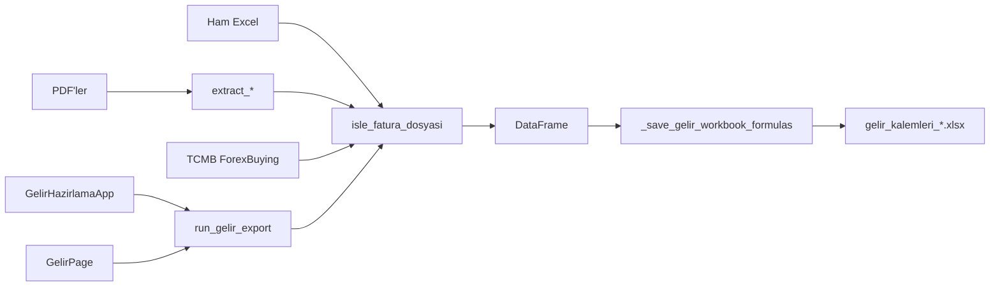

# Gelir Hazırlama — Not Defteri

> Bu dosya, programın nasıl çalıştığını ileride unutmamak için yazıldı.  
> Tarih: 2026-07-12 · BMAD `document-project` taraması ile üretildi.

---

## 1. Bu program ne işe yarar?

Satış faturalarının **ham Excel** çıktısını (ör. `satis-faturalari_ekim.xlsx`) alır; isteğe bağlı **fatura PDF**’lerinden STB/Teknopark no, KDV istisna sebebi, iade metni, sipariş bilgisi ve AWSOLS notlarını çeker; **TCMB**’den USD alış kuru alır; muhasebe/teknopark tarafında kullanılan düzenli bir dosya üretir:

```text
gelir_kalemleri_{ay}_{yil}_çalışma.xlsx
örnek: gelir_kalemleri_eylul_2025_çalışma.xlsx
```

---

## 2. Nasıl çalıştırılır?

| Yol | Komut / dosya | Arayüz |
|-----|---------------|--------|
| Geliştirme | `run_app.bat` veya `python gelirhazirlama.py` | **Tkinter** |
| EXE | `dist\GelirHazirlama.exe` (`build_exe.bat`) | **Tkinter** |
| Birleşik suite | Harici kabuk `ui_pyside.suite_page.GelirPage` import eder | **PySide6** |

Her iki UI aynı motoru kullanır: `run_gelir_export` → `isle_fatura_dosyasi`.

**Önkoşul:** `.venv` kurulmuş olmalı; PDF için `pdfplumber`; işlem sırasında **internet** (TCMB kur).

---

## 3. Kullanıcı adımları (kısa)

1. Excel seç (ham satış faturaları).
2. İlk satırın A hücresindeki tarihten **Ay / Yıl** otomatik önerilir (açılış varsayılanı: **bugünün ay/yılı**).
3. İsteğe bağlı çoklu PDF seç (STB, istisna, iade, sipariş…).
4. Çıktı klasörü seç.
5. **İşle** — PDF seçildiyse yeniden adlandırma için onay sorulur.
6. Çıktı kaydedilir; başarı dialog’unda **özet** gösterilir. Dosya açıksa `_YYYYMMDD_HHMMSS` eklenir.
7. PDF rename onaylandıysa eşleşen PDF’ler **kaynak klasörde yeniden adlandırılabilir**.

---

## 4. Mimari (tek bakışta)



| Dosya | Rol |
|-------|-----|
| `gelirhazirlama.py` | İş motoru + Tk UI + `__main__` |
| `ui_pyside/suite_page.py` | PySide sayfası (QThread worker) |
| `run_app.bat` / `build_exe.bat` | Çalıştır / EXE üret |
| `GelirHazirlama.spec` | PyInstaller spec |

---

## 5. Ham Excel sütunları (kritik!)

Sütunlar **başlık adına** göre okunur (`_resolve_ham_excel_columns`). Sıra ve fazla kolonlar önemli değil — bilinmeyen sütunlar yok sayılır. Zorunlu başlık yoksa net hata.

| Mantıksal ad | Örnek başlık |
|--------------|--------------|
| dates | Düzenleme tarihi |
| durum | Fatura türü |
| musteri | Müşteri |
| kisa | Müşteri Kısa Adı |
| fatura_ismi | Fatura ismi |
| fatura_no | Fatura sıra |
| doviz | Döviz tipi |
| kdv_doviz | Toplam KDV |
| toplam_doviz | Genel Toplam |
| toplam_tl | Genel Toplam (TL) |
| urun | Ürün/hizmet |
| miktar | Miktar |
| kdv_oran | KDV oranı |

Başlık adı değişirse `_HAM_EXCEL_SUTUN_ALIAS` içine yeni alias ekle.

---

## 6. Çıktı sütunları

Sıra: `Ay`, `No`, `Tarih`, `Firma`, `Tür`, `Teknopark No`, `Fatura No`, `Açıklama`, `KDV TL`, `KDV siz TL`, `Toplam TL`, `KDV Dolar`, `KDV siz Dolar`, `Toplam Dolar`, `EURO`, `Durum`, `Özel Açıklama`, `Kur`, `Kur MB`  
(+ DataFrame’de `Sipariş No` / `Sipariş Sorumlusu`; Excel’de ayrıca **U/V** kolonlarına yazılır)

Dip satırda `TOPLAM` + ilgili kolonlarda `=SUM(...)` formülleri. **Özel Açıklama** dolu hücreler kırmızı font.

---

## 7. İş kuralları (unutulmaması gerekenler)

### Fatura gruplama
- Tarih dolu satır = yeni fatura grubu (`_grp`).
- Tarih boş satırlar önceki gruba bağlanır (çok satırlı ürün listesi).
- Çıktıda yalnızca tarih dolu satırlar kalır.

### Firma
- D doluysa → D  
- D boş + E doluysa → C  
- Aksi halde boş

### Açıklama
- Gruptaki ürün satırları `\n` ile birleşir.
- Miktar varsa: `"ürün N ADET"`.
- Birebir `INSURANCE COST` ve `FREIGHT COST` atılır.
- `Firma == "AWSOLS"` ise PDF’deki `Not: Fatura Açıklaması` satırları `- ` önekli eklenir.

### Teknopark No / PDF eşleme
- Varsayılan: `"-"`.
- PDF dosya adından fatura no çıkarılır; Excel fatura no ile **büyük harf birebir** eşleşirse STB kodu yazılır.
- İçerik map’leri (STB, istisna, iade, sipariş, AWSOLS) da birebir eşleşme ister.
- PDF rename: önce tam eşleşme; yoksa yalnızca rakamlar. Tek aday → `{FATURA}_{FIRMA}.pdf`; birden fazla → **AMBIGUOUS**, rename yok.

### KDV / TL / USD
- KDV TL: `kv = total - total / (1 + rate/100)`; net = `total - kv` (2 hane).
- İADE (Durum içinde `"İADE"`) → dolar kolonları 0; Özel Açıklama’ya iade metni.
- `KDV TL == 0` → Özel Açıklama’ya PDF istisna sebebi.
- Döviz ≠ USD/TRL/TRY → Q tutarı `EURO` kolonuna.
- `Toplam TL ≈ Toplam Dolar` (< 0.01) → USD alanları 0.
- Kur: TCMB önceki iş günü **ForexBuying**; veya mevcut TL/USD oranı.
- **Kur MB**: tüm satırlar için TCMB (tarih cache); `Kur`’dan bağımsız.

### Sıralama
Harfle başlayan fatura no’lar önce (A–Z), rakamla başlayanlar sonra, boş en sonda; sonra `No` 1…n yeniden numaralanır.

---

## 8. Ana fonksiyonlar (nerede ne var?)

| Fonksiyon / sınıf | Ne yapar |
|-------------------|----------|
| `get_tcmb_dollar_rate` | Önceki iş günü USD ForexBuying |
| `extract_fatura_no_from_filename` | PDF adından fatura no |
| `extract_stb_proje_kodu` | STB / Teknopark kodu |
| `extract_vergi_istisna_muafiyet_sebebi` | KDV istisna metni |
| `extract_iade_aciklama` | İade metni |
| `extract_not_fatura_aciklama` | AWSOLS notu |
| `extract_siparis_bilgileri` | Sipariş No + Sorumlu |
| `isle_fatura_dosyasi` | Ana pipeline |
| `run_gelir_export` | Tk/PySide ortak API + kaydet |
| `_save_gelir_workbook_formulas` | SUM, kırmızı font, U/V |
| `GelirHazirlamaApp` | Tk UI |
| `GelirPage` / `_GelirWorker` | PySide UI + arka plan thread |

---

## 9. Tuzaklar (gelecekteki “ben” için)

1. Ham Excel kolonları **başlık adına** bağlı; fazla kolonlar yok sayılır. Başlık adı değişirse alias ekle.
2. **PDF rename geri alınmaz** — kaynak klasörde dosya adı değişir.
3. **Tk senkron** — TCMB döngüsü UI’yi dondurabilir; PySide thread’li.
4. **PySide6 `requirements.txt`’te yok**; EXE sadece Tk paketler.
5. Ham Excel zorunlu başlık yoksa → hata; fazla sütunlar yok sayılır; tarih tipi coerce edilir.
6. **SSL fallback doğrulamasız** — yalnızca TCMB isteği.
7. Sipariş alanları hem DataFrame’de hem U/V’de — kolon düzeni bozulmasın diye sabit U/V.

---

## 10. Daha ayrıntılı dokümanlar

| Dosya | İçerik |
|-------|--------|
| [index.md](./index.md) | Ana indeks (AI / geliştirme girişi) |
| [project-context.md](./project-context.md) | AI agent’lar için uygulama kuralları |
| [project-overview.md](./project-overview.md) | Genel bakış |
| [architecture.md](./architecture.md) | Mimari ve veri akışı |
| [source-tree-analysis.md](./source-tree-analysis.md) | Klasör ağacı |
| [component-inventory.md](./component-inventory.md) | Bileşenler |
| [development-guide.md](./development-guide.md) | Kurulum ve build |
| [deployment-guide.md](./deployment-guide.md) | EXE dağıtım |

---

_BMAD Method `bmad-document-project` · exhaustive scan · 2026-07-12_
